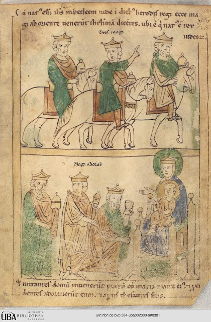

ADVENT OF CODE - 2025 - IN TCL
==============================

This project is a collection of solutions to the [Advent of Code 2025](https://adventofcode.com/2025)
problems, implemented in Tcl.

 
  
 Adoration of the Three Wise Men from the
 <a href="https://eu.wikipedia.org/wiki/Iru%C3%B1eko_Bibliak"> illustrated Bible</a>
 of
 <a href="https://eu.wikipedia.org/wiki/Antso_VII.a_Nafarroakoa">Sancho VII the Strong</a>
 of
 <a href="https://eu.wikipedia.org/wiki/Nafarroako_Erresuma">Navarre</a> from the year 1199

Full List:

- Day 1: Secret Entrance: [01.tcl](./01.tcl), [enunciation](https://adventofcode.com/2025/day/1). 
- Day 2: Gift Shop: [02.tcl](./02.tcl), [enunciation](https://adventofcode.com/2025/day/2).
- Day 3: Lobby: [03.tcl](./03.tcl), [enunciation](https://adventofcode.com/2025/day/3).
- Day 4: Printing Department: [04.tcl](./04.tcl), [enunciation](https://adventofcode.com/2025/day/4).
- Day 5: Cafeteria: [05.tcl](./05.tcl), [enunciation](https://adventofcode.com/2025/day/5).
- Day 6: Trash Compactor: [06.tcl](./06.tcl), [enunciation](https://adventofcode.com/2025/day/6).
- Day 7: Laboratories: [07.tcl](./07.tcl), [enunciation](https://adventofcode.com/2025/day/7).
- Day 8: Playground: TODO, [enunciation](https://adventofcode.com/2025/day/8).
- Day 9: Movie Theater: [09.tcl (p1)](./09.tcl), [enunciation](https://adventofcode.com/2025/day/09).

Install tcl `sudo apt-get -y install tcl tk` and then run with `tclsh ./01.tcl`. You
can also run the [gui](./aoc2025.tcl) with `wish ./aoc2025.tcl` 😉.

## Previous years.

- [2015 in C99](https://github.com/harkaitz/advent-of-code-2015-c99)
- [2024 in Tcl/Tk](https://github.com/harkaitz/advent-of-code-2024-tcl)

